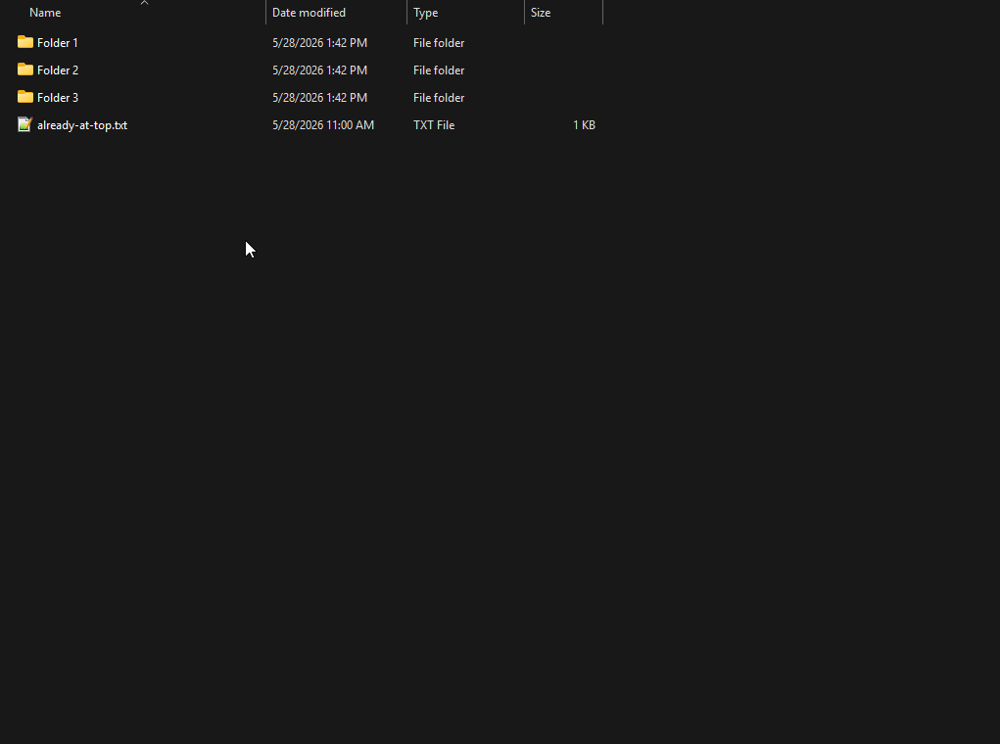

# flatten-here

Right-click any folder in Windows Explorer, pick **Flatten files here**, every file under that folder's subtree moves into it. Single ~2 MB native AOT exe. No .NET runtime needed.



## Install

1. Download `FlattenHere.exe` from the [releases page](https://github.com/hardtokidnap/flatten-here/releases).
2. Double-click it. The installer dialog shows what will be written; expand **Show details** for the install path and registry keys.
3. Click **Install for current user**.
4. Right-click any folder and pick **Flatten files here**.

To uninstall, double-click the same exe again. The dialog detects the existing install and offers Uninstall or Reinstall.

### SmartScreen on first run

The exe is unsigned. On first launch Windows may show **Windows protected your PC**. Click **More info**, then **Run anyway**. The SHA-256 on the release page lets you verify the download.

### Long-path support (optional)

The installer dialog has a checkbox for enabling system-wide long-path support (>260 chars). Flipping it sets `HKLM\SYSTEM\CurrentControlSet\Control\FileSystem\LongPathsEnabled` to 1, which needs admin. The exe is already declared long-path-aware in its manifest, so once the system flag is on, files with paths past the old MAX_PATH work.

## Modes (modifier keys at click time)

| Modifiers     | Behavior                                                    |
| ------------- | ----------------------------------------------------------- |
| (none)        | Confirm, move every file from subfolders, show summary      |
| Ctrl          | Dry-run preview. No files moved; a log is written.          |
| Shift         | Move, then delete subfolders that are now empty             |
| Ctrl + Shift  | Dry-run preview of the Shift behavior                       |

Name collisions get a numeric rename (`name (2).ext`, `name (3).ext`, ...). A `flatten-here.log` is appended next to the target folder, or to `%TEMP%\flatten-here-<pid>.log` if the target isn't writable.

Shift-click on a folder that's already flat still cleans up empty subfolders.

## Safety

flatten-here refuses to run on:

- `%SystemRoot%` (typically `C:\Windows`)
- `%ProgramFiles%`, `%ProgramFiles(x86)%`
- `%ProgramData%`
- The root of any drive (`C:\`, `D:\`, ...)
- `%UserProfile%` (the root, not subfolders)
- `%AppData%` and `%LocalAppData%` (roots only)
- `$Recycle.Bin`, `System Volume Information`
- Top-level folders on the system drive (e.g. `C:\Photos`; one level deeper like `C:\Photos\2024` is fine)

No override flag, on purpose.

Junctions and symlinks inside the tree are skipped, not traversed. Cross-volume moves use copy + length-verify + delete.

## Command-line use

```powershell
# Interactive installer dialog (same as double-click)
FlattenHere.exe --install

# Silent install / uninstall
FlattenHere.exe --install   --quiet
FlattenHere.exe --uninstall --quiet

# Machine-wide install (writes HKLM + %ProgramFiles%, needs admin)
FlattenHere.exe --install --machine --quiet

# Also flip the long-paths system flag (needs admin)
FlattenHere.exe --install --enable-long-paths

# One-off flatten from a terminal
FlattenHere.exe --path "D:\Photos\2024"
FlattenHere.exe --path "D:\Photos\2024" --dry-run
FlattenHere.exe --path "D:\Photos\2024" --cleanup
```

`--dry-run` and `--cleanup` override the live Ctrl / Shift state when the exe runs from a terminal.

## Build from source

Prereqs:

- .NET 8 SDK
- Visual Studio 2022 or 2026 (or VS Build Tools) with the **Desktop development with C++** workload (needed for the Native AOT linker)

```powershell
dotnet test FlattenHere.sln -c Release
pwsh ./publish.ps1
```

`publish.ps1` prepends the VS Installer directory to PATH so `vswhere.exe` is reachable, then runs `dotnet publish -c Release -r win-x64`. Output: `src/bin/Release/net8.0-windows/win-x64/publish/FlattenHere.exe`.

## License

MIT. See [LICENSE](LICENSE).
